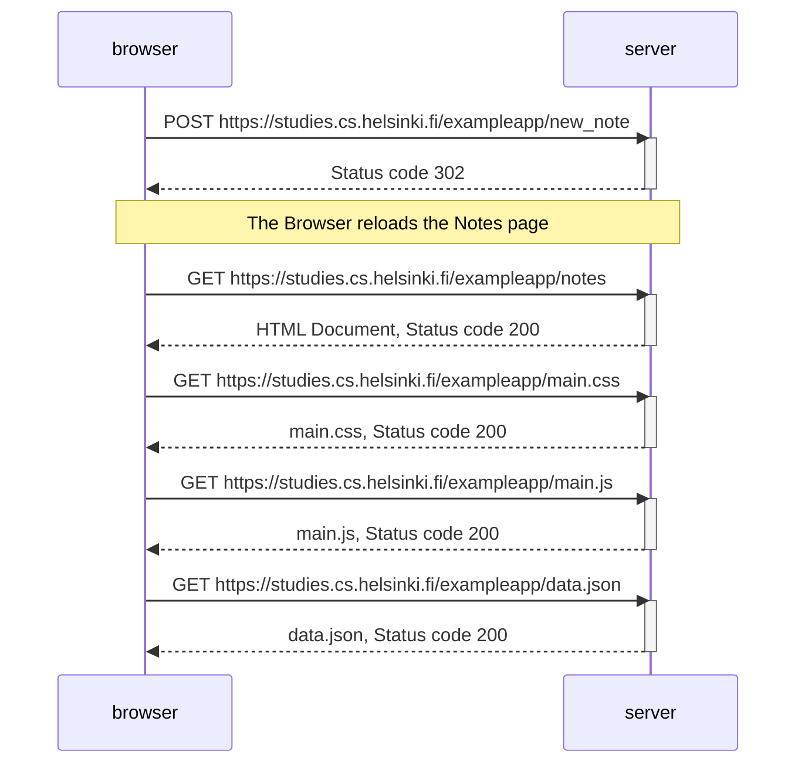

```mermaid

  sequenceDiagram
  participant browser
  participant server

  browser->>server : POST https://studies.cs.helsinki.fi/exampleapp/new_note
  activate server
  server-->>browser : Status code 302
  deactivate server

  Note over browser,server: The Browser reloads the Notes page

  browser->>server : GET https://studies.cs.helsinki.fi/exampleapp/notes
  activate server
  server-->>browser : HTML Document, Status code 200
  deactivate server

  browser->>server : GET https://studies.cs.helsinki.fi/exampleapp/main.css
  activate server
  server-->>browser : main.css, Status code 200
  deactivate server

  browser->>server : GET https://studies.cs.helsinki.fi/exampleapp/main.js
  activate server
  server-->>browser : main.js, Status code 200
  deactivate server

  browser->>server : GET https://studies.cs.helsinki.fi/exampleapp/data.json
  activate server
  server-->>browser : data.json, Status code 200
  deactivate server
```
