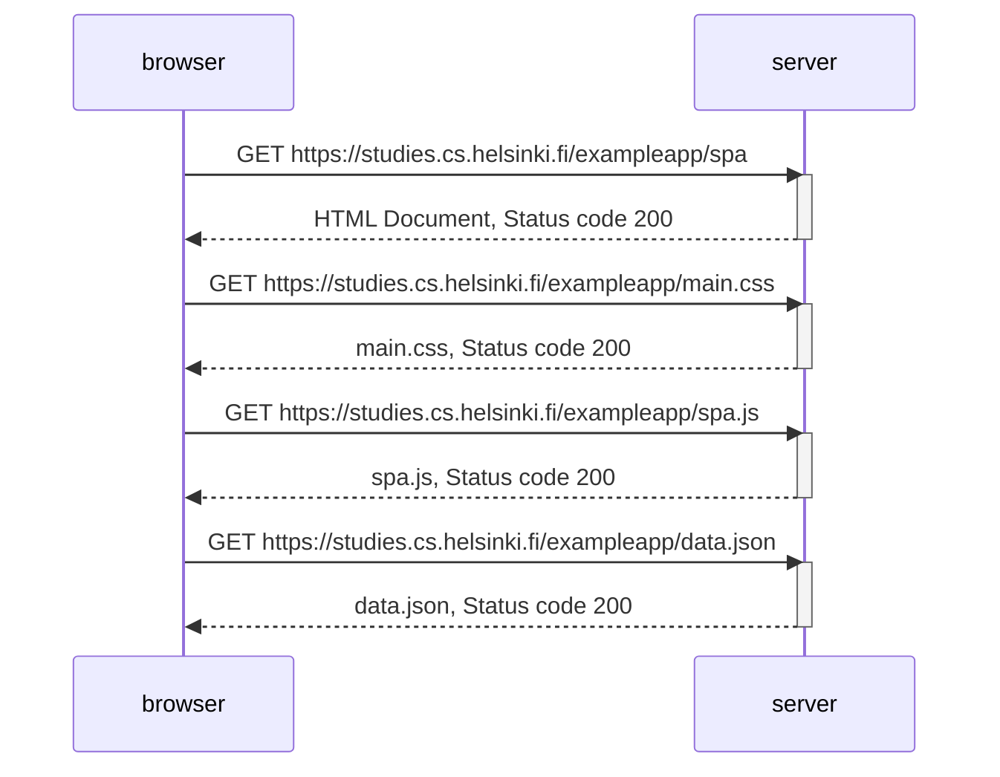

```mermaid

  sequenceDiagram
  participant browser
  participant server

  browser->>server : GET https://studies.cs.helsinki.fi/exampleapp/spa
  activate server
  server-->>browser : HTML Document, Status code 200
  deactivate server

  browser->>server : GET https://studies.cs.helsinki.fi/exampleapp/main.css
  activate server
  server-->>browser : main.css, Status code 200
  deactivate server
  
  browser->>server : GET https://studies.cs.helsinki.fi/exampleapp/spa.js
  activate server
  server-->>browser : spa.js, Status code 200
  deactivate server
  
  browser->>server : GET   https://studies.cs.helsinki.fi/exampleapp/data.json
  activate server
  server-->>browser : data.json, Status code 200
  deactivate server

```
